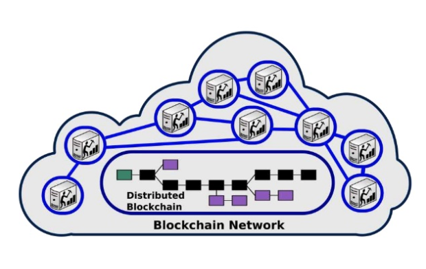

## Brief history of the blockchain + Ethereum + Solidity + Smart Contracts

---

## Miguel Vieira - @vieirapt
Co-Founder and CTO eSolidar

vieira@esolidar.com

@eSolidar

---
## About the Talk 

* Intro 
* Blockchain Overview
* Ethereum Overview
* Smart Contracts 
* Solidity Overview
* What is an ERC20 token
* ICO on Ethereum 
* Questions 

---
## #eSolidarDEV
#### Telegram - http://t.me/eSolidarDEV

---

### Blockchain
* Blockchain is like a public ledger of transactions
* Blockchain does not want to trust a third party to administer the ledger
* Blockchain is like Google Docs
* Blockchain is like DNA
+++

### Blockchain

Blockchain Network

+++

### Blockchain

#### Blockchain principle
* 1. A user wants to pay another user some bitcoins, he broadcasts a transaction to the network.
* 2. Miners add the transaction as they receive it to their current block, the one they are currently working on.
+++

### Blockchain

#### Blockchain principle
* 3. Randomly, one of the miner may win the lottery and "mine" the block (we'll get back to that).
* 4. At that moment, this new "definitive" block is broadcasted to the network and added to averyone's copy of the blockchain.
+++

### Blockchain

---

### Ethereum 

   

     Ethereum Network
     
  

  

    

      “Each node of the Ethereum network hosts a blockchain database and 
      a node client capable of executing application code stored on blockchain.
      Nodes communicate through Wire protocol and expose same interface but 
      can be implemented in different languages.”
    

     
    

      Excerpt From: Roberto Infante. “Building Ethereum ÐApps” 
    

  

+++

### Ethereum
* Bitcoin like distributed ledger 
* Cryptocurrency (Ether - FUEL)
* Ethereum Virtual Machine (EVM) 
* Turing-Completeness
+++

### Ethereum
* Two kinds of accounts 
  * External Accounts (wallets controlled by humans - private keys)
  * Contract Accounts (controlled by code)
  * every accounts has a balance 
+++

### Ethereum
* Ethereum account contains four fields 
  * The nonce, a counter used to make sure each transaction can only be processed once
  * The account's current ether balance
  * The account's contract code, if present
  * The account's storage (empty by default)
+++

### Ethereum
* Code execution costs GAS 
* Transaction is a message sent from one account to another and can have a data
  payload
+++

### Ethereum
* Transactions
  * The recipient of the message
  * A signature identifying the sender
  * The amount of ether to transfer from the sender to the recipient
  * An optional data field
  * A STARTGAS value, representing the maximum number of computational steps the transaction execution is allowed to take
  * A GASPRICE value, representing the fee the sender pays per computational step
+++

### Ethereum
* Messages
  * The sender of the message (implicit)
  * The recipient of the message
  * The amount of ether to transfer alongside the message
  * An optional data field
  * A STARTGAS value
+++

### Ethereum
* Ethereum Blockchain
  * Contracts (code) 
  * Storage
  * Logs
  * Events
+++

### Ethereum
* Code Execution (EVM)
  * The code in Ethereum contracts is written in a low-level (bytecode) to EVM.
  * The code consists of a series of bytes, where each byte represents an operation.
  * In general, code execution is an infinite loop (Turing-Completeness)
  * ...until the end of the code is reached or an error or STOP or RETURN instruction is detected.
+++

### Ethereum
* The operations have access to three types of space in which to store data:
  * The <b>stack</b>, a last-in-first-out container to which values can be pushed and popped
  * <b>Memory</b>, an infinitely expandable byte array
  * The contract's long-term <b>storage</b>, a key/value store. Unlike stack and memory, which reset after computation ends, storage persists for the long term.
+++
  
---

## Smart Contracts 

+++