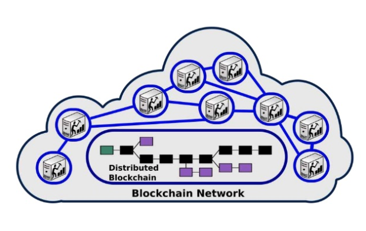

## Brief history of the blockchain + Ethereum + Solidity + Smart Contracts

---

## Miguel Vieira - @vieirapt
Co-Founder and CTO eSolidar

vieira@esolidar.com

@eSolidar

---
## About the Talk 

* Intro 
* Blockchain Overview
* Ethereum Overview
* Smart Contracts 
* Solidity Overview
* What is an ERC20 token
* ICO on Ethereum 
* Questions 

---
## #eSolidarDEV
#### Telegram - http://t.me/eSolidarDEV

---

### Blockchain
* Blockchain is like a public ledger of transactions
* Blockchain does not want to trust a third party to administer the ledger
* Blockchain is like Google Docs
* Blockchain is like DNA
+++

### Blockchain

Blockchain Network

+++

### Blockchain
## Blockchain principle
* A user wants to pay another user some bitcoins, he broadcasts a transaction to the network.
* Miners add the transaction as they receive it to their current block, the one they are currently working on.
* Randomly, one of the miner may win the lottery and "mine" the block (we'll get back to that).
* At that moment, this new "definitive" block is broadcasted to the network and added to averyone's copy of the blockchain.
+++

### Blockchain