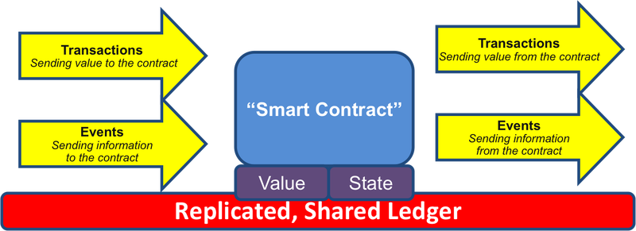

## Brief history of the blockchain + Ethereum + Solidity + Smart Contracts

---

## Miguel Vieira - @vieirapt
Co-Founder and CTO eSolidar

vieira@esolidar.com


@eSolidar

---
## About the Talk 

* Intro 
* Blockchain Overview
* Ethereum Overview
* Smart Contracts 
* Solidity Overview
* What is an ERC20 token
* ICO on Ethereum 
* Questions 

---
## #eSolidarDEV
#### Telegram - http://t.me/eSolidarDEV

---

### Blockchain
* Blockchain is like a public ledger of transactions
* Blockchain does not want to trust a third party to administer the ledger
* Blockchain is like Google Docs
* Blockchain is like DNA
+++

### Blockchain

Blockchain Network

+++

### Blockchain

#### Blockchain principle
* 1. A user wants to pay another user some bitcoins, he broadcasts a transaction to the network.
* 2. Miners add the transaction as they receive it to their current block, the one they are currently working on.
+++

### Blockchain

#### Blockchain principle
* 3. Randomly, one of the miner may win the lottery and "mine" the block (we'll get back to that).
* 4. At that moment, this new "definitive" block is broadcasted to the network and added to averyone's copy of the blockchain.
+++

### Blockchain


---

### Ethereum 

   <div class="left">
     Ethereum Network
     
  </div>

  <div class="right">
    <p>
      “Each node of the Ethereum network hosts a blockchain database and 
      a node client capable of executing application code stored on blockchain.
      Nodes communicate through <span class="highlight">Wire protocol</span> and expose same interface but 
      can be implemented in different languages.”
    </p>
    <br>
    <p class="lowernote">
      Excerpt From: Roberto Infante. “Building Ethereum ÐApps” 
    </p>
  </div>

+++

### Ethereum
* Bitcoin like distributed ledger 
* Cryptocurrency (Ether - FUEL)
* Ethereum Virtual Machine (EVM) 
* Turing-Completeness
+++

### Ethereum
* Two kinds of accounts 
  * External Accounts (wallets controlled by humans - private keys)
  * Contract Accounts (controlled by code)
  * every accounts has a balance 
+++

### Ethereum
* Ethereum account contains four fields 
  * The nonce, a counter used to make sure each transaction can only be processed once
  * The account's current ether balance
  * The account's contract code, if present
  * The account's storage (empty by default)
+++

### Ethereum
* Code execution costs GAS 
* Transaction is a message sent from one account to another and can have a data
  payload
+++

### Ethereum
* Transactions
  * The recipient of the message
  * A signature identifying the sender
  * The amount of ether to transfer from the sender to the recipient
  * An optional data field
  * A STARTGAS value, representing the maximum number of computational steps the transaction execution is allowed to take
  * A GASPRICE value, representing the fee the sender pays per computational step
+++

### Ethereum
* Messages
  * The sender of the message (implicit)
  * The recipient of the message
  * The amount of ether to transfer alongside the message
  * An optional data field
  * A STARTGAS value
+++

### Ethereum
* Ethereum Blockchain
  * Contracts (code) 
  * Storage
  * Logs
  * Events
+++

### Ethereum
* Code Execution (EVM)
  * The code in Ethereum contracts is written in a low-level (bytecode) to EVM.
  * The code consists of a series of bytes, where each byte represents an operation.
  * In general, code execution is an infinite loop (Turing-Completeness)
  * ...until the end of the code is reached or an error or STOP or RETURN instruction is detected.
+++

### Ethereum
* The operations have access to three types of space in which to store data:
  * The <b>stack</b>, a last-in-first-out container to which values can be pushed and popped
  * <b>Memory</b>, an infinitely expandable byte array
  * The contract's long-term <b>storage</b>, a key/value store. Unlike stack and memory, which reset after computation ends, storage persists for the long term.
+++
  
---

## Smart Contracts 

+++

##### What are Smart Contracts?
<p class="lowernote">
  <span class="highlight">Vitalik Buterin</span> — a smart contract approach, an asset or currency is transferred into a program “and the program runs this code and at some point it automatically validates a condition and it automatically determines whether the asset should go to one person or back to the other person, or whether it should be immediately refunded to the person who sent it or some combination thereof.”In the meantime, the decentralized ledger also stores and replicates the document which gives it a certain security and immutability.
</p>

+++

### Smart Contracts 

Smart contract flow of data 

+++

### Smart Contracts 
* Contract = code (i.e. functions) + data (i.e. state) and resides on the blockchain 
* EVM is the runtime for Smart Contracts on Ethereum
* Accounts have a persistent memory area which is called storage
* Contracts can neither read nor write to any storage apart from their own
+++

### Smart Contracts 
* Contracts can call other contracts 
* 1024 max call stack depth (vbuterin: Substitute call stack limit with child gas restriction)
* Support Events
* Contracts can purge themselves from the blockchain (OPCODE selfdestruct)

---

## Solidity Programming Language
https://solidity.readthedocs.io/
+++

### Solidity 

Solidity is a contract-oriented, high-level language for implementing smart contracts. It was influenced by C++, Python and JavaScript and is designed to target the Ethereum Virtual Machine (EVM).

+++

### Solidity 

Has some contract-specific features like:
* modifier (guard) clauses
* event notifiers for listeners 
* custom global variables.
+++

### Solidity 
Hello World

```javascript
  pragma solidity ^0.4.19;

  contract HelloWorld {

  }

```
<p class="lowernote">
  <span class="highlight">version pragma</span> — declares the version of the compiler to be used 
  to avoid breaking changes introduced on future versions
</p>
+++

### Solidity 
Statically typed language 

```javascript
  contract Example {
    // This will be stored permanently in the blockchain
    uint myUnsignedInteger = 100;
    string name;
  }
```

* `uint data type` is an unsigned integer (non-negative number) 
* `int data type` is used for signed integers
* uint has 256 bits we can also have uint8, uint16, uint32 
+++

### Solidity 
More complex data types - Structs 

```javascript
  struct TokenHolder {
    uint age;
    string obs;
  }

  // Arrays
  string[5] stringArray;
  // a dynamic Array - has no fixed size, can keep growing:
  uint[] dynamicArray;
  // Public array
  TokenHolder[] public shareHolders;
```
+++

### Solidity 
Mappings and data type address 

```javascript 
  // For a financial app, storing a uint that holds the user's account balance:
  mapping (address => uint) public accountBalance;

  // Or could be used to store / lookup usernames based on userId
  mapping (uint => string) userIdToName;
```

<ul class="lowernote">
  <li> first example, the key is an address and the value is a uint</li> 
  <li> second example, the key is a uint and the value is a string</li>
</ul>

+++

### Solidity 
Function declarations 

```javascript
  uint[] scores;

  function addNewScore(string _clientId, uint _score) public {
     ... 
     _updateScores(_score);
  }

  function _updatesScores(string _clientId, uint _number) private {
    ...
    scores.push(_number) {
    ...
  }
```
+++


<p class="lowernote">
  So in this case we could declare it as a <b>view</b> function, meaning it's only viewing the data but not modifying it: 
</p>

```javascript
function sayHello() public view returns (string) {
```

<p class="lowernote">
    Solidity also contains <b>pure</b> functions, which means you're not even accessing any data in the app. Consider the following:
</p>

```javascript
function _multiply(uint a, uint b) private pure returns (uint) {
  return a * b;
}
```

+++

### Solidity 
More about functions

```javascript
  string greeting = "Oláaaa ?";

  function sayHello() public returns (string) {
      return greeting;
  }
```
+++

### Solidity 
Function Modifiers 

```javascript
  function sayHello() public view returns (string) {

  function _multiply(uint a, uint b) private pure returns (uint) {
    return a * b;
  }

  // Functions can return many arguments, and by specifying returned arguments
  // names we don't need to explicitly return
  function increment(uint x, uint y) returns (uint x, uint y) {
      x += 1;
      y += 1;
  }
  // when a function returns multiple values we need to parallel assign 
  (x1, y1) = increment(1,2);
```
+++

### Solidity 
More on functions Modifiers

```javascript
  modifier onlyAfter(uint _time) { require (now >= _time); _; }
  modifier onlyOwner { require(msg.sender == owner) _; }

  // Append right after function declaration
  function changeOwner(newOwner) onlyAfter(someTime) onlyOwner() {
      owner = newOwner;
  }
```
<p class="lowernote">
Modifier Order Matters. If atStage is combined with timedTransitions, make sure that you mention it after the latter, so that the new stage is taken into account.
</p>
+++

### Solidity 
Payable function Modifier

```javascript
  // All functions that receive ether must be marked 'payable'
  function depositEther() public payable {
      balances[msg.sender] += msg.value;
  }
```
+++

### Solidity 
Events 
<p class="lowernote">
  Events are a way for a contract to communicate that something happened 
  on the blockchain to a front-end client that is 'listening' for events 
</p>

```javascript
  // declare the event
  event IntegersAdded(uint x, uint y, uint result);

  function add(uint _x, uint _y) public returns(uint) {
      uint result = _x + _y;
      // fire an event to let the app know the function was called:
      IntegersAdded(_x, _y, result);
      return result;
  }
```
<p class="lowernote">
  A javascript implementation would look something like:
</p>

```javascript
  YourContract.IntegersAdded(function(error, result) { 
    // do something with result
  }
```
+++

### Solidity 
Inheritance
<p class="lowernote">
  One feature of Solidity that makes this more manageable is contract inheritance:
</p>

```javascript
contract Doge {
  function catchphrase() public returns (string) {
    return "So Wow CryptoDoge";
  }
}

contract BabyDoge is Doge {
  function anotherCatchphrase() public returns (string) {
    return "Such Moon BabyDoge";
  }
}
```
+++

### Solidity 
Import
<p class="lowernote">
  When you have multiple files and you want to import one file into another, Solidity uses the import keyword:
</p>

```javascript
import "./someothercontract.sol";

contract newContract is SomeOtherContract {

}
```

+++

### Solidity 
More on Function Visibility
<p class="lowernote">
  <b>Internal</b> is the same as private, except that it's also accessible to contracts that inherit from this contract.
  <b>External</b> is similar to public, except that these functions can ONLY be called outside the contract — they can't be called by other functions inside that contract.
</p>

```javascript
contract Sandwich {
  uint private sandwichesEaten = 0;

  function eat() internal {
    sandwichesEaten++;
  }
}

contract BLT is Sandwich {
  uint private baconSandwichesEaten = 0;

  function eatWithBacon() public returns (string) {
    baconSandwichesEaten++;
    // We can call this here because it's internal
    eat();
  }
}
```

+++

### Solidity 
Using an Interface
<p class="lowernote">
  In this way, your contract can <b>interact</b> with any other contract on the Ethereum blockchain, as long they expose those functions as public or external.
</p>

```javascript
contract NumberInterface {
  function getNum(address _myAddress) public view returns (uint);
}

contract MyContract {
  address NumberInterfaceAddress = 0xab38... 
  // ^ The address of the FavoriteNumber contract on Ethereum
  NumberInterface numberContract = NumberInterface(NumberInterfaceAddress);
  // Now `numberContract` is pointing to the other contract

  function someFunction() public {
    // Now we can call `getNum` from that contract:
    uint num = numberContract.getNum(msg.sender);
    // ...and do something with `num` here
  }
}
```

+++

### Solidity 
Require

For that we use <b>require</b>. <b>Require</b> makes it so that the function will throw an error and stop executing if some condition is not true:

```javascript
function sayHiToVitalik(string _name) public returns (string) {
  // Compares if _name equals "Vitalik". Throws an error and exits if not true.
  // (Side note: Solidity doesn't have native string comparison, so we
  // compare their keccak256 hashes to see if the strings are equal)
  require(keccak256(_name) == keccak256("Vitalik"));
  // If it's true, proceed with the function:
  return "Hi!";
}
```

If you call this function with <b>sayHiToVitalik("Vitalik")</b>, it will return "Hi!". If you call it with any other input, it will throw an error and not execute.

Thus <b>require</b> is quite useful for verifying certain conditions that must be true before running a function.

+++

### Solidity 
Storage vs Memory

<p class="lowernote">
    <b>Storage</b> refers to variables stored permanently on the blockchain.
</p>

```javascript
pragma solidity ^0.4.19;

import "./zombiefactory.sol";

contract ZombieFeeding is ZombieFactory {

  function feedAndMultiply(uint _zombieId, uint _targetDna) public {
    require(msg.sender == zombieToOwner[_zombieId]);
    Zombie storage myZombie = zombies[_zombieId];
    // start here
  }

}
```

+++

### Solidity 
Storage vs Memory

<p class="lowernote">
    <b>Memory</b> variables are temporary, and are erased between external function calls to your contract. Think of it like your computer's hard disk vs RAM.
</p>

```javascript
function getZombiesByOwner(address _owner) external view returns(uint[]) {
    uint[] memory result = new uint[](ownerZombieCount[_owner]);
    uint counter = 0;
    for (uint i = 0; i < zombies.length; i++) {
      if (zombieToOwner[i] == _owner) {
        result[counter] = i;
        counter++;
      }
    }
```

+++

### Solidity 
Important global variables 

```javascript
  this; // address of contract
  this.balance; // often used at end of contract life to transfer balance 
```
```javascript
  // ** msg - Current message received by the contract ** **
  msg.sender; // address of sender
  msg.value; // amount of eth sent to contract (in wei) function should be "payable"
  msg.data; // bytes, complete call data
  msg.gas; // remaining gas
```
```javascript
lastUpdated = now;
// Will return `true` if 5 minutes have passed since `updateTimestamp` was 
// called, `false` if 5 minutes have not passed
function fiveMinutesHavePassed() public view returns (bool) {
  return (now >= (lastUpdated + 5 minutes));
}
```
+++

## Important Design Notes

<ul>
  <li> 
    <span class="highlight">Obfuscation:</span> 
       All variables are publicly viewable on blockchain, so anything that is private needs to be obfuscated </li>
  <li> 
    <span class="highlight">Storage optimization:</span> 
       Writing to blockchain is expensive, as data is stored forever</li>
</ul>
+++

## Important Design Notes

<ul>
  <li> <span class="highlight">Cron Job:</span> Contracts must be manually called to handle time-based scheduling </li>
  <li> <span class="highlight">Cost of Gas:</span> the fuel Ethereum DApps run on</li>
</ul>
---

## What is an ERC20 token?
+++

### ERC20 token
ERC stands for Ethereum Request for Comments

```javascript
  contract MyToken {
      /* This creates an array with all balances */
      mapping (address => uint256) public balanceOf;

      /* Initializes contract with initial supply tokens to the creator */
      function MyToken(
          uint256 initialSupply
          ) {
          // Give the creator all initial tokens
          balanceOf[msg.sender] = initialSupply;
      }
```
+++

### ERC20 token (continuation)

```javascript
      /* Send coins */
      function transfer(address _to, uint256 _value) {
          // Check if the sender has enough
          require(balanceOf[msg.sender] >= _value);
          // Check for overflows
          require(balanceOf[_to] + _value >= balanceOf[_to]); 
          balanceOf[msg.sender] -= _value;
          balanceOf[_to] += _value;
      }
  }
```
<p class="lowernote"> (from ethereum.org)</p>
+++

### ERC20 token
<p class="lowernote">
  An ERC20 token implements the following API
</p>
<ul class="lowernote">
  <li> name </li> 
  <li> symbol</li>
  <li> decimals</li>
  <li> transfer(to, value)</li>
  <li> transferFrom(from, to, value)</li>
  <li> approve(spender, value)</li>
  <li> approveAndCall(spender, value, extraData)</li>
  <li> burn(value)</li>
  <li> burnFrom(from, value)</li>
  <li>  </li>
  <li> plus trigger a set of events </li>
</ul>
<p class="lowernote">
  a complete spec of a ERC20 Token check  https://ethereum.org/token
  and https://github.com/ethereum/EIPs/blob/master/EIPS/eip-20.md
</p>
<!-- There are thousands of ethereum based tokens.(https://etherscan.io/tokens) -->
+++

### ERC20 token

```javascript
  contract ERC20Interface {
     function totalSupply() public constant returns (uint);
     function balanceOf(address tokenOwner) 
              public constant returns (uint balance);
     function allowance(address tokenOwner, address spender) 
              public constant returns (uint remaining);
     function transfer(address to, uint tokens) 
              public returns (bool success);
     function approve(address spender, uint tokens)
              public returns (bool success);
     function transferFrom(address from, address to, uint tokens)
              public returns (bool success);
 
     event Transfer(address indexed from, address indexed to, uint tokens);
     event Approval(address indexed tokenOwner, address indexed spender, uint tokens);
 }
```

Token & Crowdsale:

<ul class="lowernote">
  <li> https://www.ethereum.org/token </li> 
  <li> https://www.ethereum.org/crowdsale </li>  
</ul>

---

### How to make an ICO (crowdsale) contract
+++

### What really is an ICO ?

* An ICO - Initial Coin Offer should really be called:
token generation event (TGE) as ICO is a term initially coined for currencies
and now its being used for selling ERC20 (ethereum tokens).
* And ICO should be done automatically via a SmartContract that implements the
rules of the token sale.

+++

### ICO
To buy tokens from a smart contract participants should transfer ethereum
directly from their wallets to the smart contract address so that the
smartcontract assigns them the tokens automatically. 

+++

### Example in practice
How To Create Token and Initial Coin Offering Contracts Using Truffle + Zeppelin Solidity

+++

### Example in practice (continue)
installing some dependencies:

```javascript
$ npm install -g ganache-cli
$ npm install -g truffle
$ mkdir example_practice && cd example_practice
$ truffle init
$ npm install zeppelin-solidity@1.7.0
```

+++

### Example in practice (continue)
First step is to create the token contract.
```javascript
$ truffle init
```

<p class="lowernote">
  Side note: If we want to actually create the contract on the Ethereum testnet or main net you would have to use something like <b>Geth</b>.
  Geth (can be launched with a json-rpc server that exposes the <b>JSON-RPC API</b>) is the the command line interface for running a full ethereum node implemented in Go.
</p>

+++

### Create Token (continue)
The idea is to have a token where the supply is controlled by an owner who can emit tokens and assign them. For a better look at what this contract does, check it at node_modules/zeppelin-solidity/contracts/token/ERC20/MintableToken.sol

```javascript
pragma solidity ^0.4.17;

import "zeppelin-solidity/contracts/token/ERC20/MintableToken.sol";

contract JotaCoin is MintableToken {
  string public name = "JOTA COIN";
  string public symbol = "JTC";
  uint8 public decimals = 18;
}

```
+++

### Create Crowdsale (continue)
The following step is to create the Crowdsale contract.

```javascript
pragma solidity ^0.4.17;

import "./JotaCoin.sol";
import "zeppelin-solidity/contracts/crowdsale/CappedCrowdsale.sol";

contract JotaCoinCrowdsale is CappedCrowdsale {
  // MintableToken token = createTokenContract();
  function JotaCoinCrowdsale(uint256 _startTime, uint256 _endTime, uint256 _rate, uint256 _cap, address _wallet) public
    CappedCrowdsale(_cap)
    Crowdsale(_startTime, _endTime, _rate, _wallet)
  {

  }

  function createTokenContract() internal returns (MintableToken) {
    return new JotaCoin();
  }
}

```

<p class="lowernote">
    Note that JotaCoinCrowdsale inherits from CappedCrowdsale. In order to deploy JotaCoinCrowdsale, we must give a few parameters to its constructor function as per the Crowdsale and TimeCrowdsale contracts, i.e. openingTime and closingTime timestamps, the rate of token per ether rate, the token address itself and the wallet address of the contract owner(s).
</p>
+++

### Create a truffle migration

```javascript
$ truffle create migrate
```
<p class="lowernote">
`migrations/2_deploy_contracts.js` and modify it to this:
</p>

```javascript
let JotaCoin = artifacts.require("JotaCoin.sol");
let JotaCoinCrowdsale = artifacts.require("JotaCoinCrowdsale.sol");
let Crowdsale = artifacts.require("Crowdsale.sol");

module.exports = function(deployer, network, accounts) {
  const startTime = web3.eth.getBlock(web3.eth.blockNumber).timestamp + 1 * 60 * 60 * 24 * 30; // one second in the future
  const endTime = startTime + (86400 * 20); // 20 days
  const rate = new web3.BigNumber(5);
  const wallet = accounts[1];
  const goal = web3.toWei(250, 'ether');
  const cap = web3.toWei(400, 'ether');

  deployer.deploy(Crowdsale, startTime, endTime, rate, wallet);
  deployer.deploy(JotaCoin);
  deployer.link(JotaCoin, JotaCoinCrowdsale);
  console.log(startTime, endTime, rate, cap, wallet);
  deployer.deploy(JotaCoinCrowdsale, startTime, endTime, rate, cap, wallet);

};

```

+++

### Deploy contracts (continue)
Deploy contract from test RPC to testnet (Rinkeby)

```javascript
module.exports = {
    // See <http://truffleframework.com/docs/advanced/configuration>
    // to customize your Truffle configuration!
    networks: {
        development: {
            network_id: "*",
            host: "localhost",
            port: 8545,   // Different than the default below
            gas: 6712388,
            gasPrice: 65000000000,
        },
        rinkeby: {
            host: "localhost",
            port: 8545,
            network_id: "4", // Rinkeby ID 4
            from: "0x1f366a6ff3959b778f143c20244f7addf2a642ee", // account from which to deploy
            gas: 6712388,
            gasPrice: 65000000000,
        }
    },
    rpc: {
        host: "127.0.0.1",
        port: 8545
    }
};
```
+++

### Deploy contracts (continue)
Deploy contract from test RPC to testnet (Rinkeby)

```javascript
$ geth --datadir=./chaindata --rinkeby --rpc -rpcaddr 0.0.0.0 --rpcport "8545" --rpccorsdomain "*" --rpcapi "db,eth,net,web3,personal,network"
$ /Applications/Ethereum\ Wallet.app/Contents/MacOS/Ethereum\ Wallet --rpc /Users/miguelvieira/Documents/rinkeby/chaindata/geth.ipc
$ geth attach /Users/miguelvieira/Documents/rinkeby/chaindata/geth.ipc
```

+++

### Deploy contracts (continue)
Finally in this tab of terminal run next command:

```javascript
$ eth.syncing
```
It can return something like this:

```
{
 currentBlock: 13445,
 highestBlock: 1604086,
 knownStates: 32228,
 pulledStates: 19524,
 startingBlock: 0
}
```

What means what last block was loaded or can return «<b>false</b>» what means that full chain was loaded.
+++

### Deploy contracts (continue)
Adding funds to a test account

Go to https://www.rinkeby.io/#faucet

Etherscan:
Go to https://rinkeby.etherscan.io

+++

### Deploy contracts (continue)
Note that we are not deploying JotaCoin. This is because once JotaCoinCrowdsale deploys it will create JotaCoin. Now back to the terminal tab where you installed Truffle, run the commands:

Finally in this tab of terminal run next command:
```
$ personal.unlockAccount("0xfb0ea2323b38cb18ac2759a6a0e55bb8ec7572ab")
```

Finally to deploy your contract, use command:

```javascript
$ truffle compile
$ truffle migrate --network rinkeby
```

+++

### Deploy contracts (continue)
Alright, let’s buy some GUS tokens.

Run `$ truffle console`

```
// The account that will buy GUS tokens.
> purchaser = web3.eth.accounts[2]
```

```
// The address of the JTC token instance that was created when the crowdsale contract was deployed
// assign the result of JotaCoinCrowdsale.deployed() to the variable crowdsale
> JotaCoinCrowdsale.deployed().then(instance => { crowdsale = instance })
> undefined

> crowdsale.token().then(address => { tokenAddress = address } )
> tokenAddress
```
+++

### Deploy contracts (continue)
Alright, let’s buy some GUS tokens.


```
> jotaCoinInstance = JotaCoin.at(tokenAddress)

// change token ownership to crowdsale so it is able to mint tokens during crowdsale
> jotaCoinInstance.transferOwnership(crowdsale.address)
```

```
// Now check the number of JTC tokens purchaser has. It should have 0
> jotaCoinInstance.balanceOf(purchaser).then(balance => balance.toString(10))
  '0'
```

+++

### Deploy contracts (continue)
Buying JTC tokens

```
> jotaCoinCrowdsale.deployed().then(instance => instance.sendTransaction({ from: purchaser, value: web3.toWei(5, "ether")}))
```

```
// Check the amount of JTC tokens for purchaser again. It should have some now.
> jotaCoinInstance.balanceOf(purchaser).then(balance => purchaserJotaTokenBalance = balance.toString(10))
'5000000000000000000000'
```

```
// When we created our token we made it with 18 decimals, which the same as what ether has. That's a lot of zeros, let's display without the decimals:
> web3.fromWei(purchaserJotaTokenBalance, "ether")
'5000'

```

---

### Extra
Send ETH from geth console

First, I list the accounts and then see how much ETH I have in the default account.
```
$ personal.listAccounts
["0xfb0ea2323b38cb18ac2759a6a0e55bb8ec7572ab", "0x1f366a6ff3959b778f143c20244f7addf2a642ee"]

$ web3.fromWei(eth.getBalance(eth.coinbase));
3
```

Then I send 0.25 ETH to each account.
```
$ eth.sendTransaction({from:eth.coinbase, to:"0x1f366a6ff3959b778f143c20244f7addf2a642ee", value: web3.toWei(0.25, "ether")});
  "0x225f0bab07a7782d8d45f1a1e57c7ee7e6c0796d46a7fb664a07dd00cc5a2d8f"
```

---

## Questions ?
### Miguel Vieira - eSolidar
